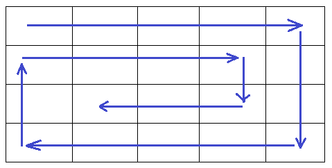

# Комбайн

## Условие задачи

Комбайну необходимо собрать урожай с прямоугольного поля размера N*M метров (N - длина, M - ширина). Ширина комбайна - 1 метр. Комбайну нужно собрать урожай со всего поля. Он начинает движение с верхнего левого угла в горизонтальном направлении до конца поля, затем он поворачивает направо и далее движется аналогичным образом. Так он продолжает свое движение по спирали до тех пор, пока весь урожай с поля не будет собран.

**Определите количество поворотов комбайна, которые необходимо совершить в процессе работы?**

Входные данные: N, M - натуральные числа от 1 до 10^9.

Вывод: количество поворотов

## Схема движения комбайна

Здесь `M=5`, `N=4`. Результат - `6`.

## Кейсы

M|N|Ответ
-|-|-
5|4|6
4|3|4
3|5|5